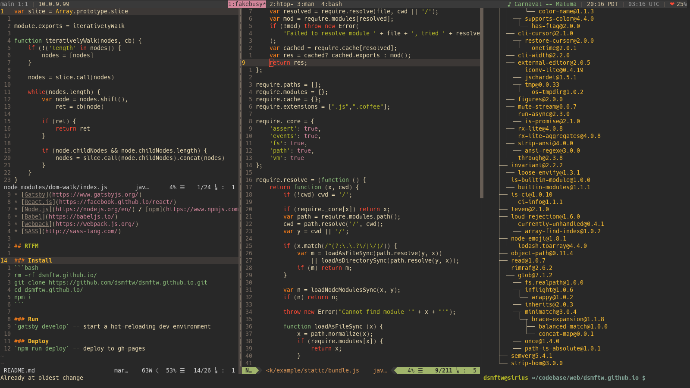
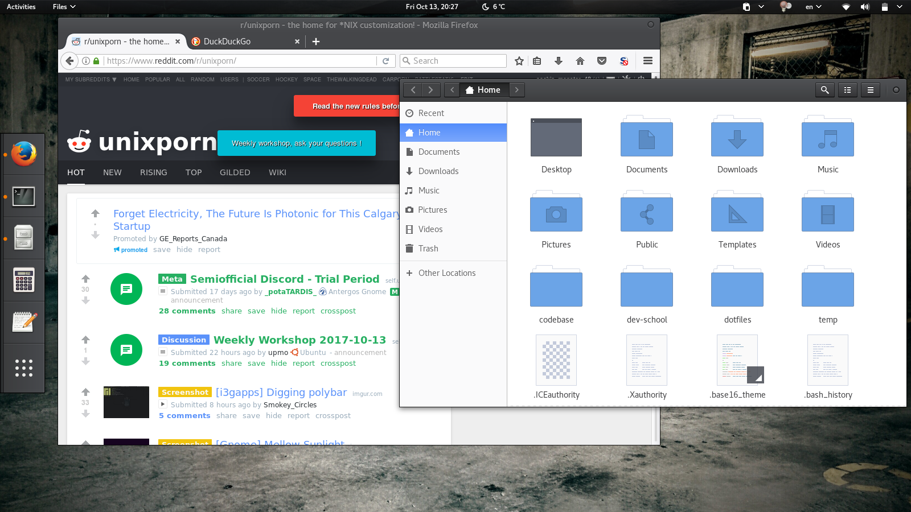

# dsmftw dotfiles

* My minimalist Linux configuration files. (Tailored towards my laptop distro. With some tweaking the dots can be used for the desktop which runs a different distro.)
* A very basic bootstrap script that creates directories and symlinks.

## Installation

Strart with cloning plugins of choice.

### get plugins for

#### shell colors

* [base16-shell](https://github.com/chriskempson/base16-shell)

#### vim

* [pathogen](https://github.com/tpope/vim-pathogen)
* [ctrlp.vim](https://github.com/ctrlpvim/ctrlp.vim)
* [gruvbox](https://github.com/morhetz/gruvbox)
* [syntastic](https://github.com/vim-syntastic/syntastic)
* [vim-airline](https://github.com/vim-airline/vim-airline)
* [vim-airline-themes](https://github.com/vim-airline/vim-airline-themes)
* [vim-json](https://github.com/elzr/vim-json)
* [vim-surround](https://github.com/tpope/vim-surround)

### install dotfiles

Clone dotfiles:

```bash
git clone https://github.com/dsmftw/dotfiles.git ~/dotfiles
```

Run script to create symlinks:

```bash
cd ~/dotfiles
./bootstrap.sh
```

The `dotfiles/bootstrap.sh` script will create directories as needed and backup any existing files before overwriting with symlinks (with a `.bak` extension).

## Fonts via Portage

* media-fonts/hack
    * terminal font
* media-fonts/powerline-symbols
    * needed for `vim-airline`

Set terminal font size to **10**.

## Screenshots





